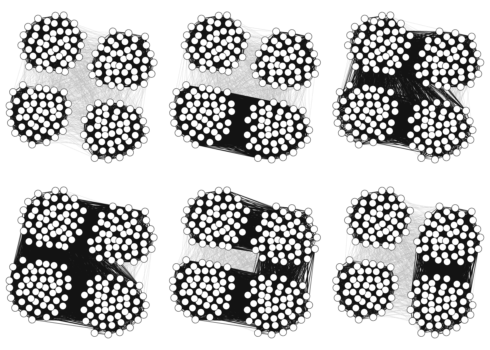
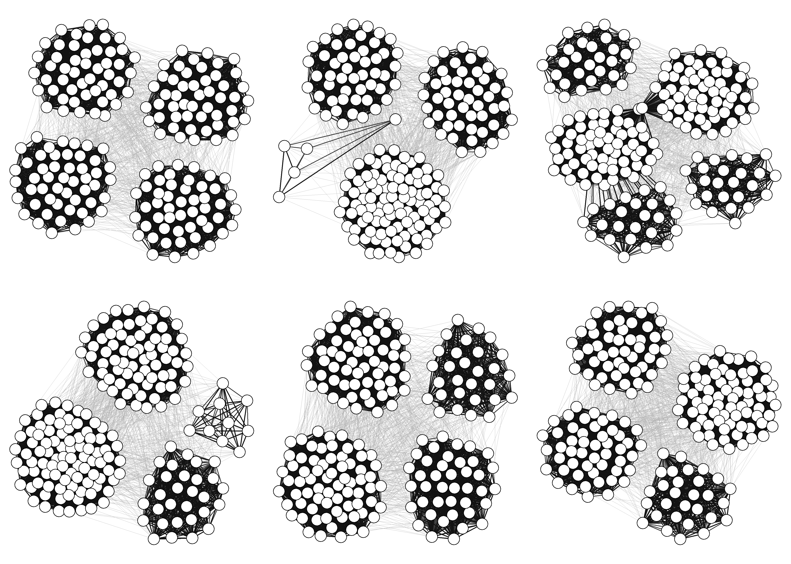
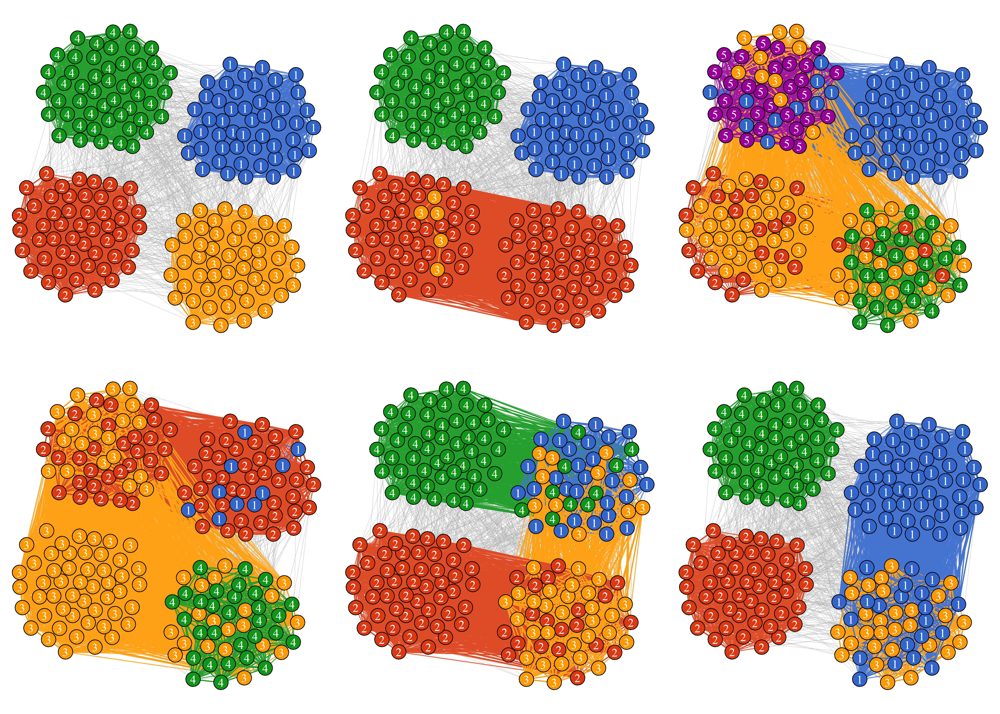
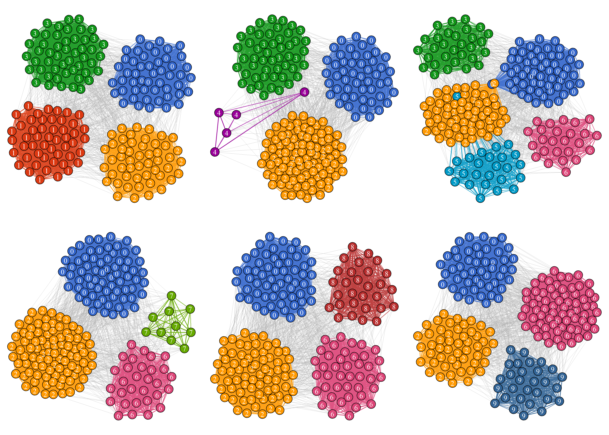
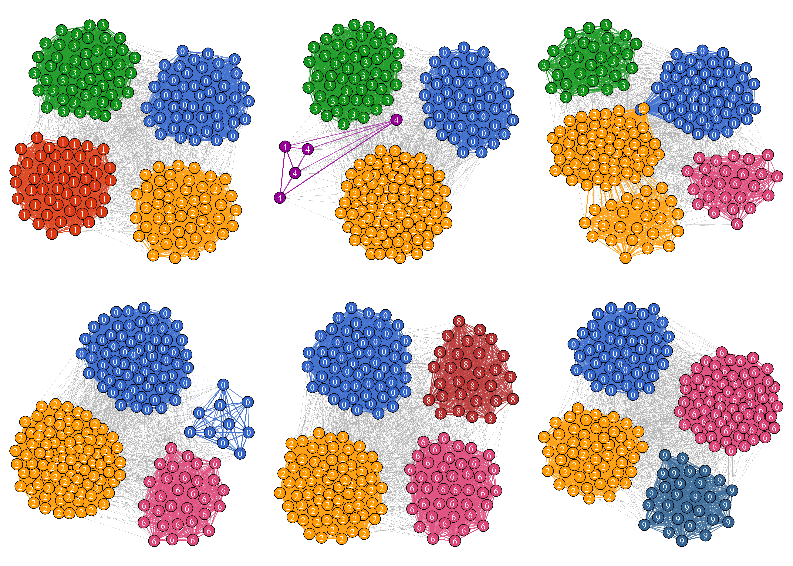
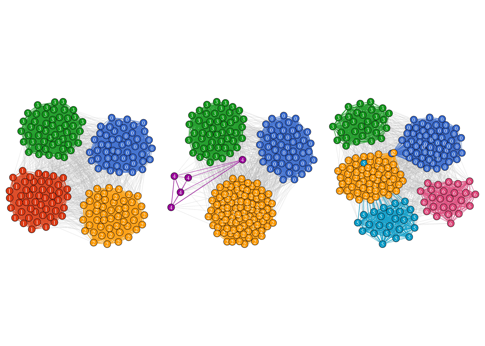
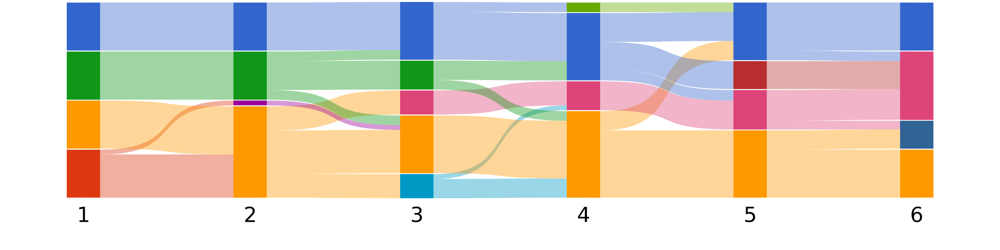
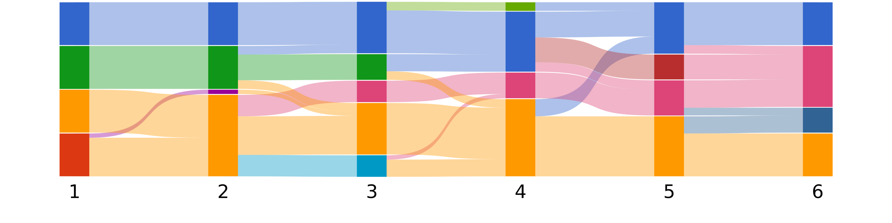

<!-- README.md is generated from README.Rmd. Please edit that file -->

# MajorTrackR

R interface for the majortrack python library for carrying out dynamic
community detection method tracking persistent but transiently
discontinuous communities in time window graphs. See:
<https://github.com/j-i-l/MajorTrack> for required python library See:
<https://majortrack.readthedocs.io/en/latest/> for python documentation.
See: <https://arxiv.org/abs/1912.04261> for associated paper.

## Installation

MajorTrackR requires a python install (3+) with MajorTrackR installed.
Most common scientific python distributions such as Anaconda sould be
fine. Once you have python installed, you can install MajorTrack from
the [github repository](https://github.com/j-i-l/MajorTrack). Using pip
is the easiest way to do this:

``` bash
pip install --upgrade git+https://github.com/j-i-l/majortrack.git
```

Once this is done, you can install the R package using:

``` r
devtools::install_git("https://github.com/jevansbio/MajorTrackR",build_vignettes = T)
```

Once this is ready, you can start working with MajorTrack in R

Firstly we need to load the appropriate packages. We’ll use igraph to
build our networks.

``` r
library(igraph)
library(MajorTrackR)
```

For this tutorial we’ll use some generated network data. See the full
vignette for the code to generate this from scratch.

``` r
data(allnets)
```

For each series of networks, I’ll show both a consistent layout where
nodes remain in the same place in each timestep, and a per-timestep
layout where nodes will shift position depending on their social
associations during that timestep.





## 2. Detecting communities

If this were a real network, we’d need to detect our communities. The
method you use to do this will depend on on your style of network. I am
using Louvain clustering here:

``` r
#detect each networks communities
coms=lapply(allnets,function(x){
    cluster_louvain(x)
})


#apply community membership as node attribute
allnets=lapply(1:length(allnets),function(x){
    V(allnets[[x]])$com=coms[[x]]$membership
    allnets[[x]]
})

#For convenience, just pull out the memberships
allcoms=lapply(1:length(allnets),function(x){
  coms[[x]]$membership
})
```

Our node order doesn’t change between networks and the communities are
very clear, so the algorithm does pretty well returning some community
memberships in the same order each time. However this means some
strangeness, such as in the second timestep where community 4 (green)
gets reassigned as community 3 (gold), because the original community 3
merges with community 2. Though this is pretty obvious here, this might
not be the case with real networks! Keeping track of a community
consistently over time is one of the main advantages of majortrack




## 3. Running MajorTrack

To run MajorTrack we need We also specify the history, start and stop
parameters. We’ll investigate history some more in a moment, but start
and stop are fairly straightforward. If no stop is provided, the
algorithm will just run to the end of the timesteps.

``` r
track <- do_track(allnets, coms, history=1)#run MajorTrack
#> Do MajorTrack
```

Once we have this object we can get the membership of the “Dynamic
communities”, communities which persist over all the timesteps. These
can then be added to our networks as a node attribute.

``` r
dcmembership=get_dc_membership(track)
allnets = add_dc_membership(allnets,dcmembership)
```




You’ll immediately notice a few things. First, this time round there is
no reassigning of communities in the same timestep just because the
number of communities has changed. The dynamic community remains the
same.

You might also notice that the merging and splitting of communities
results in completely new dynamic communities being “created”, such as
the purple community in timestep 2 when the yellow and red communities
merge. In this case, this is because both merging communities were
exactly the same size. The algorithm is therefore unable to decide which
community merges with which and assigns them a new community

This slower transition eventually results in the membership of the dark
blue community completely changing by the last timestep. The dark blue
community in the final timestep has exactly the same membership as the
dark green community from the first timestep. The membership has
essentially “swapped” due to the gradual change in membership.

Similarly, the purple community in the final timestep has exactly the
same membership as the bright red community in the first timestep. In
this case, the original community was “destroyed” during merging. The
purple community then gradually changes membership until it reflected
the original “destroyed” community. MajorTrack will not recover
destroyed communities even if they have the same membership.

A couple of communities exist only for a single timestep (bright pink in
timestep 3, light green in timestep 4, dark red in timestep 5). The
emergence of these dynamic communities is dependant on the history
parameter. Take a look at the same analysis run with a longer history
parameter.

``` r
track2 <- do_track(allnets, coms, history=6)#run MajorTrack
#> Do MajorTrack
dcmembership2=get_dc_membership(track2)
allnets2 = add_dc_membership(allnets,dcmembership2)
```




Here, the bright pink and light green communities never emerge. The
longer history parameter leads to MajorTrack recognising these as being
part of the dark blue and purple communities, as they merge back into
these communities in the subsequent timestep. The dark red community in
timestep 4 remains however, as these individuals then merge with the
light blue community, rather than returning to the dark blue community.

## 4. Getting more information about where dynamic communities come from

Some of the above might be hard to get just from the network diagrams.
We can generate data tables that give us this information more clearly.
The first thing we’ll generate is a dataframe of “move events” showing
the relationships between DCs from one timestep to another.

The table consists of 6 columns. The first column indicates the
timestep, starting from the second timestep. The second column “parent”
indicates which dynamic community in the previous timestep a “child”
dynamic community (third column) emerged from in this timestep.

The fourth column shows the type of event. This can be a “merge” - a
dynamic community being created due to two dynamic communities joining
together, a “split” - a dynamic community emerging as the result of a
single dynamic community splitting up, a “move” - some nodes moving from
one previously existing dynamic community to previously existing another
and finally a “remain” - nodes staying in the same dynamic community as
the previous timestep. By default, these only appear in the table if the
parent/child is also involved in some other event.

The fifth column “moveid” is a unique identifier combining the timestep,
parent and child columns. Finally the “size” column shows how many nodes
were involved in a particular event.

Here is an example of the first 3 timesteps in our networks, with
MajorTrack run with a history parameter of 1.

``` r
comorigins = move_events_df(track)
head(comorigins, 9)#just the first two timesteps
#>    slice parent child   type moveid size
#> 24     2      1     4  merge  2 1 4   50
#> 25     2      2     4  merge  2 2 4   50
#> 26     3      0     0 remain  3 0 0   50
#> 4      3      3     0   move  3 3 0   10
#> 5      3      3     3 remain  3 3 3   30
#> 6      3      3     4   move  3 3 4   10
#> 1      3      4     4 remain  3 4 4   50
#> 2      3      4     5  split  3 4 5   25
#> 3      3      4     6  split  3 4 6   25
```



Each of the initial 4 communities we assigned consisted of 50 nodes. So
Looking at the first 6 rows of the data table, we can see that all 50
members of DC 1 and all 50 members of DC 2 merge to create DC 4.

In the next timestep, we can see that all members of DC 0 stayed in that
community, but were joined by 10 members of DC 3. Another 10 members of
DC 3 moved to DC 4, while the remaining 30 members remained where they
were. DC 5 and DC 6 emerge as new DCs by splitting from DC 4.

Here is another example of the first 3 timesteps in our networks, with
the longer history parameter.

``` r
comorigins2 = move_events_df(track2)
head(comorigins2, 9)#just the first two timesteps
#>    slice parent child   type moveid size
#> 21     2      1     4  merge  2 1 4   50
#> 22     2      2     4  merge  2 2 4   50
#> 23     3      0     0 remain  3 0 0   50
#> 3      3      3     0   move  3 3 0   10
#> 4      3      3     3 remain  3 3 3   30
#> 5      3      3     4   move  3 3 4   10
#> 1      3      4     4 remain  3 4 4   75
#> 2      3      4     6  split  3 4 6   25
#> 27     4      0     0 remain  4 0 0   60
```


The major difference here is that due to the extended history parameter,
DC 6 does not emerge here. Instead the split is regarded as temporary.
DC 5 still splits from DC 4.

We can find out how long each DC lasts using the community_lifespans
function:

``` r
community_lifespans(track)
#> 0 1 2 3 4 5 6 7 8 9 
#> 6 1 1 3 5 1 4 1 1 1
```

## Get data about per individual dynamic community membership

It might also be useful to look at dynamic community membership at an
individual level.

``` r
indmembership = ind_membership_df(dcmembership=dcmembership)
```

This function produces a list of two objects, each showing individual
membership in a different way. The first is a dataframe with timestep,
individual ID and DC membership as 3 columns:

``` r
head(indmembership$memdf1)
#>    id timestep group
#> 9   9        1     0
#> 45 45        1     0
#> 49 49        1     0
#> 22 22        1     0
#> 1   1        1     0
#> 23 23        1     0
```

This is useful for computation. For example, per timestep group size:

``` r
  #use a dummy variable to look at how many IDs are in each combination of timestep and groupsize
  groupsizes=aggregate(rep(1,nrow(indmembership$memdf1))~group+timestep,FUN=sum,data=indmembership$memdf1,drop=F)
  names(groupsizes)[3]="groupsize"
  groupsizes$groupsize[is.na(groupsizes$groupsize)]=0
  head(groupsizes,10)
#>    group timestep groupsize
#> 1      0        1        50
#> 2      1        1        50
#> 3      2        1        50
#> 4      3        1        50
#> 5      4        1         0
#> 6      5        1         0
#> 7      6        1         0
#> 8      7        1         0
#> 9      8        1         0
#> 10     9        1         0
```

From which we could obtain max groupsize over time:

``` r
aggregate(groupsize~group,FUN=max,data=groupsizes)
#>    group groupsize
#> 1      0        70
#> 2      1        50
#> 3      2        50
#> 4      3        50
#> 5      4       100
#> 6      5        25
#> 7      6        71
#> 8      7        10
#> 9      8        29
#> 10     9        29
```

The second object in the ind_membership_df list is a matrix with a row
for each individual and a column for each timestep. This is an easily
readable way of looking at how an individual’s membership changes over
time.

``` r
head(indmembership$memdf2)
#>    1 2 3 4 5 6
#> 9  0 0 0 7 0 6
#> 45 0 0 0 0 6 6
#> 49 0 0 0 0 6 6
#> 22 0 0 0 0 8 6
#> 1  0 0 0 7 0 6
#> 23 0 0 0 0 8 6
```

We could even visualise it. This is a plot using the plot.matrix
library.


However there is definitely a better way of visualising this change over
time.

## 6. Alluvial plots for visualising flow between dynamic communities.

MajorTrack comes with a method for plotting the flow of individuals
between dynamic communities using [alluvial
plots](https://en.wikipedia.org/wiki/Alluvial_diagram). There are a few
packages for doing alluvial plots within R that I have experimented
with, but so far I have found they don’t deal well with things like
changing population size.

The R function for the MT alluvial plots is a wrapper for the python
plotting functions. It will run some python code, export an image then
bring it back into R. By default the image file will then be removed.

This is the simplest type of alluvial plot:

``` r


  get_alluvialplot(track,cols)
```

 Here I
provided the MajorTrack object and the vector of colours I have been
using throughout. At each timestep, the alluvial plot shows the size of
the community in that timestep and the flows between them.

It would be handy if we could distinguish the flows that represent
individuals remaining in the same DC between timesteps in a different
colour. For example:

``` r
  #Highlight all moves in blue, remain colour is still in grey
  get_alluvialplot(track,cols,fluxmovecol = "skyblue",fluxremaincol = "grey")
```


We can also set the flux colour depending on their source community

``` r
  
  get_alluvialplot(track,cols,fluxsinglecol = F, fluxsinglecolremain = F)
```



or the target community.

``` r
  
  get_alluvialplot(track,cols,fluxsinglecol = F,fluxbysource = F, fluxsinglecolremain = F)
```



As with above, we can choose to separate the flows representing
individuals remaining in the same DC. So in this plot, the flows where
individuals shift between different communities, either due to moving or
due to splitting and merging, are highlighted in the colour of the
source community.

``` r
  
  get_alluvialplot(track,cols,fluxsinglecol = F,fluxbysource = T, fluxsinglecolremain = T)
```


Other arguments are primarily for controlling the plot. The labeling is
passed to the python figure, as are the size and initial margins of the
figure.

The rmargin argument controls where the alluvial plot (blocks and flows)
is placed in the overall plotting area. This consists of a vector of
numbers between 0 and 1 in the format <b>left,bottom,right,top</b>. By
default the alluvial plot takes up the entirety of the plotting area,
except for the bottom where a gap is left for the labels (0.2).

Control of the initial size of the exported file is controlled using the
figwidth and figheight button. Note that if your R plotting area is
different, this can result in squashed looking figures.

You can also control the width of the DCs at each timestep with the
cwidth argument, where 1 results in no gap between timesteps and 0 makes
the clusters disappear.

``` r
  get_alluvialplot(track,cols,fluxsinglecol = F,fluxbysource = T, fluxsinglecolremain = T,
                   rlabels=c("a","b","c","d","e","f"),
                   rmargins = c(0.2,0.2,0.8,0.8),
                   figwidth=7,figheight=2,
                   cwidth=0.1,
                   labelsize=5
                   )
```


The resulting plotting device will have an x-axis where each tick is a
timestep. So for example, we can plot more things on our alluvial plot:

``` r
  get_alluvialplot(track,cols,fluxsinglecol = F,fluxbysource = T, fluxsinglecolremain = T,
                   rlabels=c("a","b","c","d","e","f"),
                   rmargins = c(0.2,0.2,0.8,0.8),
                   figwidth=7,figheight=2,
                   cwidth=0.2
                   )
  abline(v=c(1,3,6),lwd=2)
```


